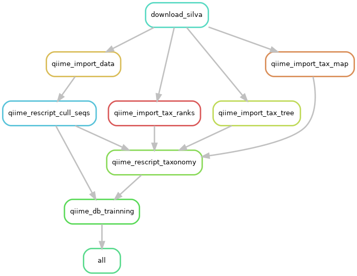
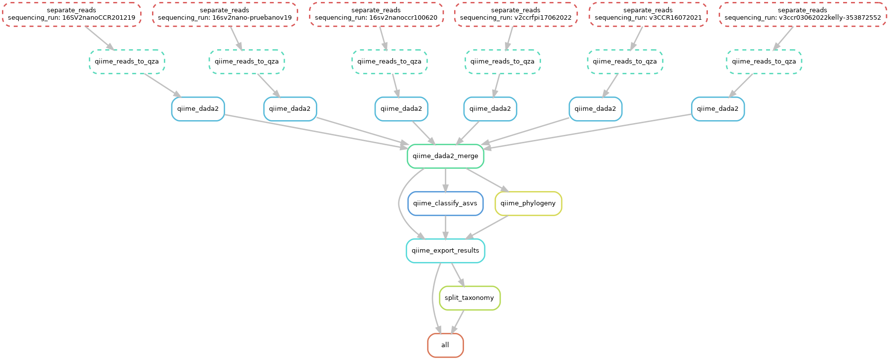
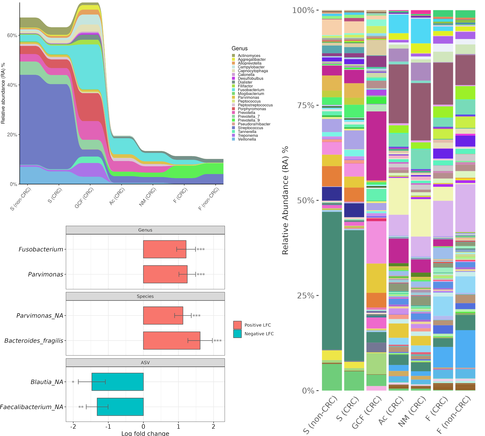

This repository contains the explanations/code to reproduce the bioinformatic analyses done in [**Undisclosed Study**]().

The main output is available with its code, output and explanation in HTML at [**`post-processing/analysis_CRC__2023-12-01.zip`**](post-processing/analysis_CRC__2023-12-01.zip)

## Index
- [Requirements](#requirements)
- [Download reads and metadata](#download-reads-and-metadata)
- [Classifier training](#classifier-trainning)
- [QIIME2 processing](#qiime2-processing)
- [Post processing](#post-processing)
- [Other analyses](#other-analyses)

## Requirements
Each step will have different requirements, but a base environment will be used to run the Snakemake and Python scripts. You will need also have Conda/Mamba installed (with mamba being highly recommended).

```sh
# Main env (scripts are called from here)
mamba create -n snakemake_env
conda activate snakemake_env
mamba install snakemake==7.18.2 python==3.8.10 pandas==1.5.0 numpy==1.23.1 colorama matplotlib seaborn
```

Install QIIME2 environment (aslo available at `qiime2/envs/qiime2.yml`):
```sh
# Download .yml file
wget https://data.qiime2.org/distro/core/qiime2-2022.8-py38-linux-conda.yml
mamba env create -n qiime2-2022.8 --file qiime2-2022.8-py38-linux-conda.yml
rm qiime2-2022.8-py38-linux-conda.yml

# This was needed in 27 september 2022 (probably not needed in other versions)
pip install xmltodict

# Install rescript
conda activate qiime2-2022.8
python -m pip install -U git+https://github.com/bokulich-lab/RESCRIPt.git
```

Install R environment (also available at `post-processing/envs/microbiome_r_env.yml`):
```sh
# R environment for post-processing
mamba create -n microbiome_r_env
conda activate microbiome_r_env
mamba install r-base==4.2.0 bioconductor-phyloseq bioconductor-ancombc==2.0.1 bioconductor-ggtree r-plotly r-ggplot2 r-dt r-devtools r-data.table r-venndiagram r-egg r-randomcolor ggvenn
```

## Download reads and metadata

Download reads from bioproject **PRJNA911189**. Metadata can be downloaded either from the bioproject (Using both biosample and SRA metadata), but is also available in this repository at `data/non-ffpe_metadata.tsv`.

Either way, the expected metadata for the following scripts consists in a .tsv file with the columns sample-id, subject, origin, sample-type, sample-nature, sequencing-run, control-applies-to-sample-nature and control-applies-to-origin. Where origin is the type of sample (subgingival-fluid, saliva, faeces...), sample-type is the subject classification (crc or non-crc) and sample-nature indicates if the sample was paraffinated or not. The attributes "control-applies-to-*" only appear in negative controls, and will be used to remove contamination of specific samples/tissues in their respective sequencing runs.

## Classifier trainning

Train a Silva classifier for QIIME2 with `qiime2/train_qiime.smk`:

```sh
# Move to folder with qiime scripts
cd qiime2

# Activate main environment
conda activate snakemake_env

# Set up variables at the beginning of this script
# "qiime2/train_qiime.smk"

# Previsualize steps
snakemake -s train_qiime.smk --use-conda -c60 -np

# If everything is Ok, run
snakemake -s train_qiime.smk --use-conda -c60
```

<p align="center">
  
</p>


When it is done a classifier will be located at `f"{QIIME_DB_TRAINNING_OUTPUT}/silva-classifier-full.qza"`.


## QIIME2 processing

The script to run QIIME2 with the trained classifier on paired-end Illumina reads is located at `qiime2/qiime2.smk`. As it stands, it accepts a folder of reads with their name formatted in `CasavaOneEightSingleLanePerSampleDirFmt` (e.g. `{sample_id}_S{barcode_id}_L{lane_number}_R{orientation}_{set_number}.fastq.gz` like L2S357_15_L001_R1_001.fastq.gz). The element `{sample_id}` must appear in the metadata's "sample-id" column, so renaming of the reads could be neccessary. More about this format in [QIIME2 docs](https://docs.qiime2.org/2022.8/tutorials/importing/?highlight=casavaoneeightsinglelanepersampledirfmt#casava-1-8-paired-end-demultiplexed-fastq).

Reads uploaded to SRA do not have this nomenclature, but the format can be "faked" with the following code:
```py
import glob
import pandas as pd
from pathlib import Path

# Folder with reads in format {sample_id}_R{orientation}.fastq.gz
folder = "path/to/folder_with_reads"

# Get reads paths
files = glob.glob(f"{folder}/*.fastq.gz")

# Make dataframe and extract sample_ids and orientations
df = pd.DataFrame({"file":files})
df[["folder","sample_id","orientation"]] = df["file"].str.extract("(.*)/(.*)_R(\d).fastq.gz", expand=True)

# Get unique sample_ids
sample_ids = list(df["sample_id"].unique())

# Get new name to fake the CasavaOneEightSingleLanePerSampleDirFmt
# Use index in sample_ids to assign the barcode_id
def f(r):
    # {sample_id}_S{barcode_id}_L{lane_number}_R{orientation}_{set_number}.fastq.gz
    r["new_file_name"] = f"{r['sample_id']}_S{sample_ids.index(r['sample_id'])+1}_L001_R{r['orientation']}_001.fastq.gz"
    return r
df = df.apply(f, axis=1)

# Rename files
for i in df.to_dict("records"):
    old_path = Path(i['file'])
    new_path = Path(f"{i['folder']}/{i['new_file_name']}")
    # WARNING: comment this out to rename files inplace (no going back)
    # old_path.rename(new_path) 

```
To run the snakemake script:

```sh
# Move to folder with qiime scripts
cd qiime2

# Activate main environment
conda activate snakemake_env

# Set up variables at the beginning of this script
# "qiime2/qiime2.smk"

# Previsualize steps
snakemake -s qiime2.smk --use-conda -c60 -np

# If everything is Ok, run
snakemake -s qiime2.smk --use-conda -c60
```

<p align="center">
  
</p>


When it is done multiple outputs will be available, which will be the ones used in [post processing](#post-processing):
- `asvs`: 
    - `dada2`:
        - `pet-table.qza`
        - `rep-seqs-dada2.qza`
    - `classification`:
        - `taxonomy.qza`
- `export_results`:
    - `feature-table.biom`
    - `feature-table.json`
    - `feature-table.txt`
    - `taxonomy.tsv`
    - `tree.nwk`

## Post processing

A script has been developed to format and clean data, apply negative controls and to study alpha-diversity, beta-diversity, relative abundance and differential abundance. This script is available as a Rmarkdown file at `post-processing/analysis.Rmd`, with its code, output and explanation in HTML at [**`post-processing/analysis_CRC__2023-12-01.zip`**](post-processing/analysis_CRC__2023-12-01.zip). In order to run the script the `microbiome_r_env` environment must be active.

<p align="center">
  
</p>

## Other analyses

The explanation for other analyses done are available at the Methodology section of the paper under "Bioinformatic analysis". 

